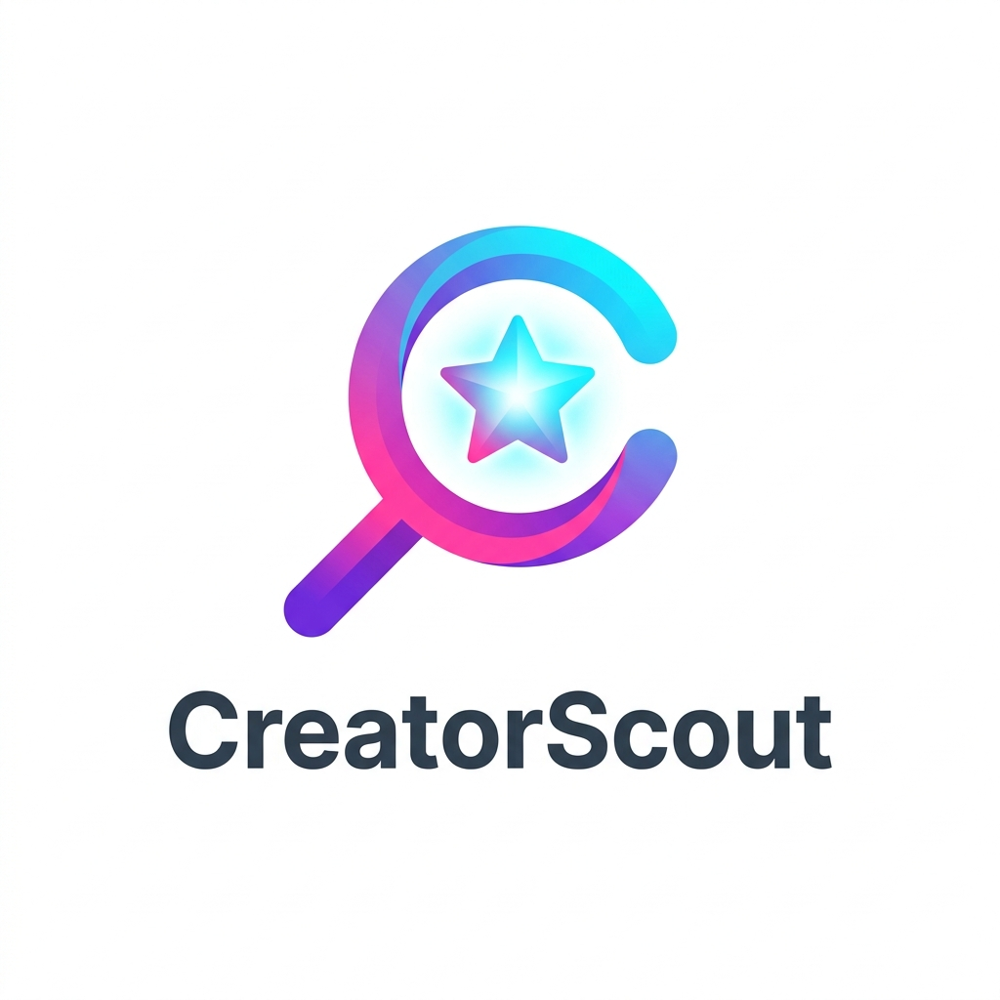

# 🚀 CreatorScout

<div align="center">



### Discover. Analyze. Collaborate.

An end-to-end creator discovery platform built for brands to find, evaluate, and shortlist creators for marketing campaigns.

Inspired by real-world influencer marketing platforms and built as a full-stack engineering project using modern technologies and production-grade architecture.


</div>

---

## ✨ Overview

CreatorScout is a creator discovery platform that enables brands to:

* Search creators by keyword
* Filter creators by niche, platform, audience country, and follower range
* Analyze creator engagement metrics
* Explore creator profiles in detail
* Save creators to a personalized shortlist
* Discover high-performing creators through a modern dashboard experience

The project consists of:

### Frontend

A responsive creator discovery dashboard built using:

* Next.js App Router
* TypeScript
* Tailwind CSS
* shadcn/ui
* React Hook Form
* Zod
* TanStack Query

### Backend

A scalable REST API built using:

* NestJS
* Prisma ORM
* PostgreSQL (Supabase)
* JWT Authentication
* DTO Validation
* Unit Testing with Jest

---

# 🏗 System Architecture

```text
┌─────────────────────┐
│     Frontend        │
│     Next.js         │
└──────────┬──────────┘
           │
           │ REST API
           ▼
┌─────────────────────┐
│      NestJS API     │
│ Controllers         │
│ Services            │
│ DTO Validation      │
└──────────┬──────────┘
           │
           ▼
┌─────────────────────┐
│      Prisma ORM     │
└──────────┬──────────┘
           │
           ▼
┌─────────────────────┐
│ PostgreSQL Database │
│     Supabase        │
└─────────────────────┘
```

---

# 🎯 Features

## Frontend

### Creator Discovery Dashboard

* Responsive UI
* Search functionality
* Advanced filtering
* Dynamic creator cards
* Loading skeletons
* Error handling
* Empty state handling

### Creator Profiles

* Detailed creator sheet
* Audience information
* Engagement metrics
* Recent content overview

### User Experience

* Modern SaaS-inspired design
* Mobile-first responsiveness
* Fast client-side filtering
* Optimized loading states

---

## Backend

### Creator API

```http
GET /creators
GET /creators/:id
```

Supports:

* Pagination
* Search
* Filtering
* Sorting

### Authentication

```http
POST /auth/register
POST /auth/login
```

Features:

* JWT Authentication
* Password hashing
* Protected routes

### Shortlists

```http
POST /shortlist
GET /shortlist
DELETE /shortlist/:creatorId
```

Allows brands to save creators for future campaigns.

---

# 🧰 Tech Stack

## Frontend

| Technology      | Purpose               |
| --------------- | --------------------- |
| Next.js 15      | Application Framework |
| TypeScript      | Type Safety           |
| Tailwind CSS    | Styling               |
| shadcn/ui       | UI Components         |
| TanStack Query  | Server State          |
| React Hook Form | Form Management       |
| Zod             | Validation            |

## Backend

| Technology | Purpose           |
| ---------- | ----------------- |
| NestJS     | Backend Framework |
| Prisma     | ORM               |
| PostgreSQL | Database          |
| Supabase   | Hosted Database   |
| JWT        | Authentication    |
| Jest       | Testing           |

---

# 📁 Project Structure

```text
CreatorScout
│
├── creatorscout-frontend
│
│   ├── src/app
│   ├── src/components
│   ├── src/hooks
│   ├── src/services
│   ├── src/types
│   └── src/data
│
└── creatorscout-backend
    │
    ├── src/auth
    ├── src/creators
    ├── src/shortlist
    ├── src/prisma
    └── prisma
```

---

# ⚙️ Local Setup

## Clone Repository

```bash
git clone https://github.com/dhairyadesai26/CreatorScout.git

cd CreatorScout
```

---

# Frontend Setup

```bash
cd creatorscout-frontend

npm install

npm run dev
```

Runs on:

```text
http://localhost:3000
```

---

# Backend Setup

```bash
cd creatorscout-backend

npm install
```

Create:

```env
DATABASE_URL=
JWT_SECRET=
```

Run migrations:

```bash
npx prisma migrate dev

npx prisma generate

npm run start:dev
```

Runs on:

```text
http://localhost:3001
```

---

# 🗄 Database Design

## User

```text
id
email
password
Shortlist
```

## Creator

```text
id
name
platform
niche
bio
followerCount
engagementRate
audienceCountry
avatarUrl
creatorScore
verified
```

## Shortlist

```text
id
userId
creatorId
createdAt
```

---

# 🧪 Testing

Run:

```bash
npm run test
```

Coverage focuses on:

* Search logic
* Filtering logic
* Pagination behavior
* Service layer correctness

---

# 💡 Engineering Decisions

### Why Next.js?

Provides a modern React architecture with App Router support and excellent developer experience.

### Why NestJS?

Offers a scalable, modular backend architecture inspired by enterprise frameworks.

### Why Prisma?

Type-safe database access, improved maintainability, and excellent TypeScript integration.

### Why TanStack Query?

Efficient data fetching, caching, synchronization, and loading state management.

### Why React Hook Form + Zod?

High-performance forms with end-to-end type-safe validation.

---

# 🚀 Future Improvements

* Creator recommendations
* AI-powered creator matching
* Campaign management
* Analytics dashboard
* Social media integrations
* Saved filter presets
* Multi-user organizations

---

# 👨‍💻 Author

**Dhairya Desai**

Computer Science Student
IIIT Vadodara

Built with a focus on production-ready architecture, scalability, and user experience.

---

<div align="center">

### CreatorScout

Find the perfect creator for every campaign.

</div>
